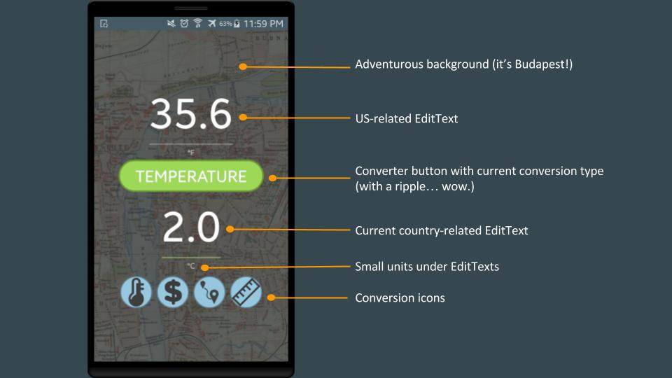
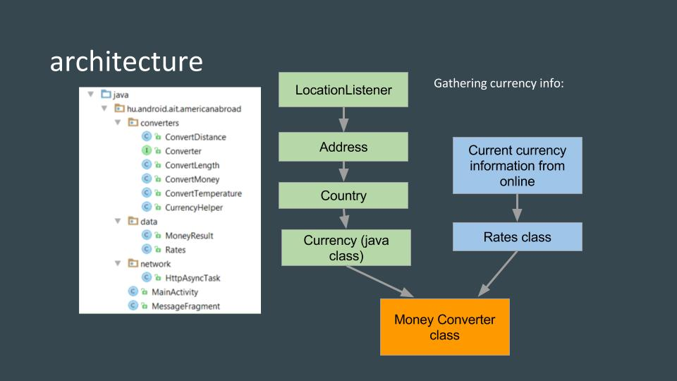

# american_abroad 
Android global converter app for Americans in other countries.
Supports temperature, length and distance conversions between metric and imperial,
   as well as currency conversions between USD and the current local currency.
   Conversions work both ways. 
   
   
   

